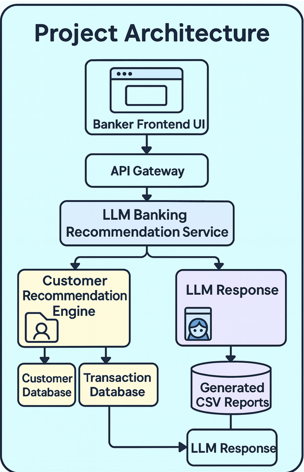

**Banker Recommendation System**

**Banker Recommendation System (LLM + Function Calling)**
An end-to-end AI-powered banking recommendation engine built using **Python** , **OpenAI function calling** , and a rule-based financial product model.

This project demonstrates how a Large Language Model (LLM) can intelligently call backend tools to produce personalized product recommendations for bank customers.

**Features**

- **✔** **Customer model** with normalization and structured attributes
- **✔** **Rule-based Product Recommender** (age, balance, occupation, account type)
- **✔** **Function-calling tool (banker_recommendation_tool)** exposed to the LLM
- **✔** **Automatic model → tool → model response pipeline**
- **✔** **Customer dataset in JSON** (get_customers())
- **✔** Export Customer Recommendation to CSV (Bonous Feature) \*\*to generates customer_recommendations.csv
- **✔** Fully compatible with gpt-5.1 tool invocation format

**Project Architecture**

**1. Customer Model**
The Customer class is designed to encapsulate the **essential personal and financial information** of an individual customer, typically for use in a banking or financial application.

class Customer:

	def _init_(self, name, age, address, occupation, balance, account_type):
 		
		self.name = name
		
		self.age = age
		
		self.address = address
		
		self.occupation = occupation.lower().strip() if occupation else ""
		
		self.balance = balance
		
		self.account_type = account_type.lower().strip() if account_type else ""

**2. Product Recommendation Model**
The ProductRecommender uses a hierarchical set of rules to categorize customers and match them with relevant financial products (e.g., specific savings accounts or checking account). The recommendation is determined by four primary factors, applied in a specific order of precedence.

**✔\*\*** Balance tiers\*\*

**✔\*\*** Occupation overrides\*\*

**✔\*\*** Age category\*\*

**✔\*\*** Existing account type\*\*

- Balance Tiers (Financial Capacity): The customer's current account balance is grouped into defined tiers, which often serve as the _primary filter_ for premium or high-value products. ** \*\***Logic:\*\* Products are gated based on minimum balance requirements (e.g., a "Gold Account" might require a balance >$50,000).
- Occupation Overrides: Certain occupations have pre-defined rules that **override** general balance- or age-based recommendations. This accounts for predictable income streams or regulatory restrictions.
  
  Logic: If the customer's occupation matches a specific value (e.g., "Student," "Self-Employed"), a specific              product set is immediately recommended or excluded.
- Age Category: The customer's age is used to categorize them by life stage, enabling recommendations for products targeted at certain demographics (e.g student , retirement accounts)
- Existing Account Type: The type of account(s) a customer already holds is used to infer their current financial needs and their affinity for related products.** \*\***Logic:\*\* If account_type is "Basic Checking," recommend an upgrade to "Premium Checking" based on their balance and usage.

Example output:
"Platinum Saving Member; Retirement Growth Plan (RGP); Overdraft Protection Plan"

**3. Customer Data Source**
This section describes the structure and format of the Customer Data Source, typically used for system initialization, analysis, or as \*\* **input for applications like the ProductRecommender. This data source serves as a standardized collection of customer records, providing essential personal and financial information in a machine-readable format (JSON). a **JSON array** where each element in the array is a single **JSON object\*\* representing one customer record.

[

{
"name": "Maria Lopez",

"age": 33,

"occupation": "Engineer",

"balance": 185000,

"address": "5324 W Main Street",

"account_type": "checking"
},
...
]

**4. Tool: banker_recommendation_tool**
This section describes the banker_recommendation_tool, a Python function designed to be exposed to a Large Language Model (LLM) via OpenAI's function-calling mechanism. Its purpose is to retrieve a customer's information and generate a tailored product recommendation. The tool accepts a customer's name as input, searches the customer database, and uses the ProductRecommender logic to return a specific product recommendation along with key customer details.

def banker_recommendation_tool(name: str):
   	
	customers = get_customers()
  
  	recommender = ProductRecommender()

    for c in customers:
	
    	if c["name"].lower() == name.lower():
		
          customer_obj = Customer(
		  
          name=c["name"],
		  
          age=c.get("age"),
		  
          address=c.get("address"),
		  
          occupation=c.get("occupation"),
		  
          balance=c.get("balance"),
		  
          account_type=c.get("account_type")
    )
    return {
        "name": c["name"],
        "occupation": c["occupation"],
        "balance": c["balance"],
        "recommendation": recommender.recommend(customer_obj)
    }
    return {"error": f"No customer found with name {name}"}

**5. Tools Definition**
This section describes the standardized schema used to define and expose the banker_recommendation_tool to a Large Language Model (LLM) utilizing systems like OpenAI's function-calling feature. This schema array (TOOLS) serves as the official manifest that informs the LLM about the external functions it can call. It ensures the LLM understands the **name** , **purpose** , and required **inputs** for the tool, allowing it to correctly generate the necessary JSON arguments for execution.

The LLM uses this schema to call the tool:

TOOLS = [

{

	"type": "function",

	"function": {

		"name": "banker_recommendation_tool",

		"description": "Return the banking recommendation for a given customer name.",

		"parameters": {

			"type": "object",

			"properties": {

				"name": {"type": "string"}
			},
    		"required": ["name"]
    	}
      }
    }
]

**6. LLM Pipeline (Model → Tool → Model)**
This section describes the three-stage process used by the application to handle a user request that requires the use of an external tool—specifically, the banker_recommendation_tool. This pattern is known as the **Model → Tool → Model** pipeline. The primary goal of this pipeline is to leverage the LLM's natural language understanding to correctly identify the need for a function call, execute that function, and then use the function's output to generate a final, accurate, and contextually rich response for the user.

**Input message**

messages = [

  {

     "role": "user", 

     "content": "Generate a banking recommendation for Maria Lopez."
 
   }
 ]

response = client.chat.completions.create(

  model="openai:gpt-5.1",
  
  messages=messages,
  
  tools=TOOLS
)

msg = response.choices[0].message

**Execute the tool if needed to validate**

if msg.tool_calls:

	tool_call = msg.tool_calls[0]
	
	args = json.loads(tool_call.function.arguments)
	
	tool_response = banker_recommendation_tool(\*\*args)
	
	print("TOOL RESPONSE:", tool_response)

**7. Export Customer Recommendation to CSV (Bonous Feature)** \*\*\*\*

This document describes the bonus functionality for exporting customer product recommendations to a CSV file. The **Export to CSV** feature provides a mechanism to generate a comprehensive spreadsheet containing customer details and their corresponding product recommendations. This is useful for auditing, analysis, or sharing the recommendations outside of the application.

**8. Example Full Run**

**User:**

Generate a banking recommendation for Maria Lopez.

Model Calls Tool:

{
"tool": "banker_recommendation_tool",

"arguments": { "name": "Maria Lopez" }

}

Tool Response:

{
"name": "Maria Lopez",

"occupation": "engineer",

"balance": 185000,

"recommendation": "VIP Member; Certificate of Deposit (Silver CD); Tech Professional Investment Plan; Retirement Growth Plan (RGP); Overdraft 
Protection Plan"
}
