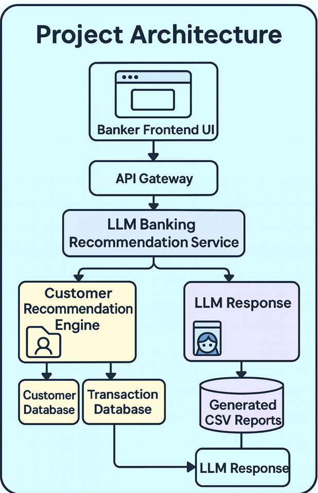
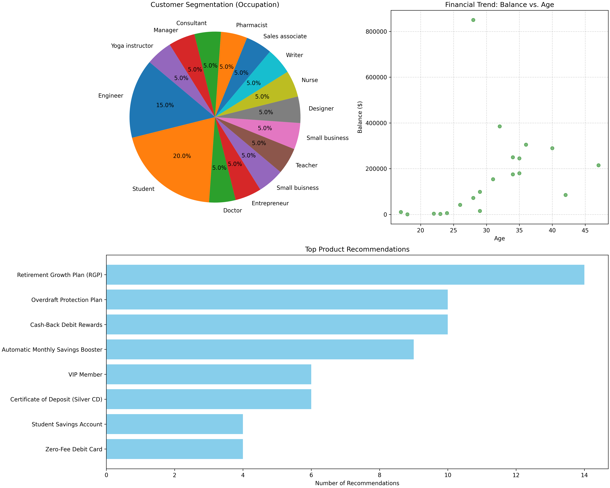

<p align="center">
  
</p>

<h1 align="center">🏦 Bank Recommendation AI Model</h1>

<p align="center">
  AI-powered system for personalized financial product recommendations
</p>

<p align="center">
  
  
  
  
</p>

## 📚 Table of Contents
- Overview
- Features
- Installation
- Usage
- Results
- Future Work
  
**Project Overview**

This repository demonstrates a complete end-to-end recommendation system where a Large Language Model (LLM) intelligently interacts with backend logic to recommend appropriate bank products tailored to individual customer attributes such as age, balance, occupation, and account type.

## ❗ Problem Statement

Banks struggle to recommend the right products to customers due to:
- Large volumes of customer data
- Lack of personalization
- Inefficient manual decision-making

This project solves that using machine learning.

## Features

- Personalized recommendations
- Data preprocessing pipeline
- ML model training
  
## 📁 Project Structure

Bank_recommendation_AI_Model/</br>
├── 📂 data/                </br>
├── 📂 notebooks/           </br>
├── 📂 src/                 </br>
├── 📂 models/              </br>
├── 📂 assets/              </br>
├── README.md               </br>
└── requirements.txt        </br>

⚙️ **The system leverages:**

- Python for business logic and tool implementation
- OpenAI function calling to integrate LLM reasoning with structured backend functions
- A rule-based recommendation model representing real-world product eligibility

**🚀 Installation**

# Clone the repository
git clone https://github.com/negash/Bank_recommendation_AI_Model.git

# Navigate into the project
cd Bank_recommendation_AI_Model

# Install dependencies
pip install -r requirements.txt

**Optional :**

Create and activate a virtual environment to isolate project dependencies:

**Create a virtual environment**

python -m venv .venv

**Activate the virtual environment**

source .venv/bin/activate

**▶️ Usage**
# Run notebook
jupyter notebook

# OR run script
python src/main.py

**Key Features**

##   Key Features

-   **Customer Modeling**
   Structured customer profiles with normalized attributes for accurate analysis  

-   **Rule-Based Recommendation Engine**
   Suggests banking products based on age, balance, occupation, and account type  

-   **LLM Tool Integration**
   Seamless function-calling pipeline connecting AI models with recommendation logic  

-   **Automated Decision Pipeline**
   End-to-end flow: input → model → tool → intelligent response  

-  **JSON-Based Data Handling**
   Flexible and scalable customer dataset management  

-  **CSV Export**
   Generate customer recommendation reports for analysis and business use  

-  **Modern AI Compatibility**
   Fully compatible with advanced LLM tool invocation frameworks
    
**Project Architecture**



**1. Customer Model**

A Customer class that encapsulates core personal and financial information such as:

- Name
- Age
- Address
- Occupation
- Balance
- Account type

This standardized model enables consistent input handling and recommendation logic execution.

**2. Product Recommendation Logic** The Product Recommender uses a set of hierarchical rules to match customers with the right financial products Logic is based on:

**Balance Tiers** — Groups customers by account balance.

**Occupation Overrides** — Occupation-specific rules that adjust product eligibility.

**Age Categories** — Life-stage based product targeting.

**Account Type** — Existing account influences upgrade or complementary product offers.

Example output might include recommendations like:

VIP Member; Silver CD; Investment Plan; Retirement Growth Plan; Overdraft Protection

**3. Function:** banker_recommendation_tool

A Python function exposed to the LLM via OpenAI’s function calling interface:

def banker_recommendation_tool(name: str):

```
customers = get_customers()
recommender = ProductRecommender()

for c in customers:
    if c["name"].lower() == name.lower():
        customer_obj = Customer(
            name=c["name"],
            age=c.get("age"),
            address=c.get("address"),
            occupation=c.get("occupation"),
            balance=c.get("balance"),
            account_type=c.get("account_type")
        )
        return {
            "name": c["name"],
            "occupation": c["occupation"],
            "balance": c["balance"],
            "recommendation": recommender.recommend(customer_obj)
        }
return {"error": f"No customer found with name {name}"}
```

This tool accepts a customer name, retrieves the corresponding record, runs the recommendation logic, and returns a structured recommendation response.

**4. LLM Interaction Pipeline**

The system follows a **_Model → Tool → Model_** workflow:

. User issues a natural language request to generate a recommendation.
. The LLM identifies when a function call is needed and calls banker_recommendation_tool.
. The backend executes the function and returns results.
. The LLM produces the final formatted recommendation.

**Example Usage**

**User request:** "Generate a banking recommendation for Maria Lopez"

**LLM triggers:** banker_recommendation_tool(name="Maria Lopez")

messages = [

{

```
 "role": "user",

 "content": "Generate a banking recommendation for Maria Lopez."
```

} ]

response = client.chat.completions.create(

model="openai:gpt-5.1",

messages=messages,

tools=TOOLS )

msg = response.choices[0].message

**Execute the tool if needed to validate**

if msg.tool_calls:

```
tool_call = msg.tool_calls[0]

args = json.loads(tool_call.function.arguments)

tool_response = banker_recommendation_tool(\*\*args)

print("TOOL RESPONSE:", tool_response)
```

**Response: { "name": "Maria Lopez", "occupation": "engineer", "balance": 185000, "recommendation": "VIP Member; Silver CD; Tech Professional Investment Plan; Retirement Growth Plan (RGP); Overdraft Protection Plan" }**

**5. Export Customer Recommendation to CSV (Bonus Feature)**

This document describes the bonus functionality for exporting customer product recommendations to a CSV file.The Export to CSV feature provides a mechanism to generate a comprehensive spreadsheet containing customer details and their corresponding product recommendations. This is useful for auditing, analysis, or sharing the recommendations outside of the application.

[](https://github.com/negash/Bank_recommendation_AI_Model/blob/main/assets/customer_recommend_csv.png)

**6. Customer Analytics Dashboard**

The **Analytics Module** (analytics.py) processes customer demographic and financial data to generate a consolidated visual report. It bridges the gap between raw customer profiles and actionable business intelligence.

**Key Feature:**

- **Segment Insights** : A pie chart visualizing the distribution of customer occupations (e.g., Engineer, Student, Entrepreneur).
- **Predictive Trends** : A scatter plot analyzing the correlation between Age and Account Balance to identify high-value demographics.
- **Product Demand** : A ranked bar chart showing the most frequently recommended financial products based on the system's logic.
- **Single-File Output** : Generates a high-resolution customer_analytics_dashboard.png for easy sharing and reporting.

**Analytics output :**



**Future Improvements**
- Deep Learning models
- Real-time recommendation API
- Streamlit / Web dashboard

📜 License

This project is licensed under the MIT License.

👤 Author

Negash

GitHub: https://github.com/negash
